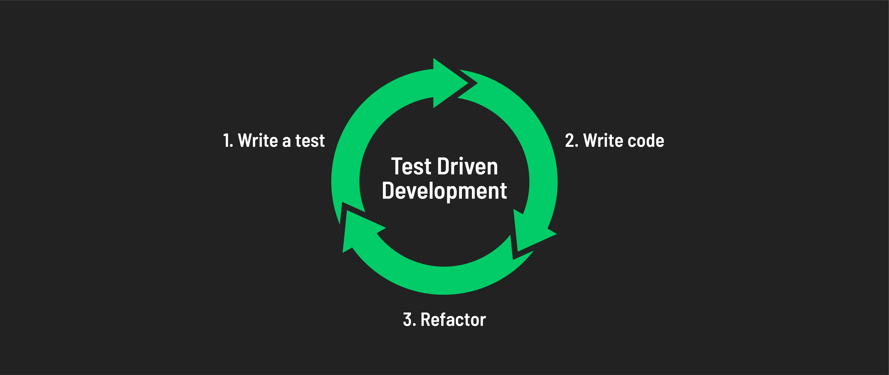

# 

**Learning Objective:** By the end of this lesson, students will be able to explain what unit testing is, why it's useful, and demonstrate basic unit testing in JavaScript using Mocha and Chai.

## Introduction to Unit Testing

Unit Testing involves writing code that tests small, individual units of code in a larger codebase (like a function or method) to ensure they perform as expected. The idea is that smaller tests give us a very in-depth look at each piece of a larger puzzle, helping to eliminate bugs that can come about from multiple units of code interacting in unexpected or unplanned ways.

### Why is Unit Testing Important?

Unit tests serve as a reliable source of truth in the dynamic environment of application development. They provide immediate feedback to developers about how their new code impacts other parts of the codebase, ensuring that new features or changes do not disrupt existing functionalities. This becomes increasingly important as codebases grow and become more complex.

### Test-Driven Development (TDD)

In TDD, developers write tests before the actual code. Hence the name- Test _Driven_ Development. Developers use a **test-code-refactor** cycle to write their code. Write the tests first, then only write enough code to pass the tests, and then refactor the code without changing the behavior or causing the tests to fail. This ensures that the code is written to meet the requirements of the tests.



TDD increases efficiency, as it reduces the time spent on debugging and refactoring. For more info about TDD practices, check out [this TDD article](https://www.spiceworks.com/tech/devops/articles/what-is-tdd/).

## Practical Example in JavaScript

As our codebase grows and becomes more complex, effective testing is key. We need to constantly ask ourselves: does each function work as it should with different inputs? And what about the less obvious, edge cases – could they cause unexpected issues in the larger codebase? By thoroughly testing each small section of our code, we can catch and address potential problems early on. This proactive approach saves us time and hassle in tracking down bugs later.

Consider the function:

```javascript
const addTwo = (x, y) => {
  return x + y;
};
```

To thoroughly test this code, we'd start with basic logic checks. For instance, does it correctly add two numbers? We'd test typical scenarios like `addTwo(2, 3)` and expect the result to be `5`.

But that's just the beginning. We also need to think about edge cases – situations that aren't the usual but are still possible. What if one or both inputs are non-numeric, like `addTwo(2, '3')` or `addTwo('a', 'b')`? How about cases where an argument is missing, like `addTwo(5)`? Should the function handle these scenarios gracefully, maybe by throwing an error or returning a specific value?

Without even writing a single line of Unit Test, we can identify potential weaknesses in our `addTwo` function. For example, it currently doesn't account for type checking or missing arguments. Recognizing these issues helps us refine the function, ensuring it’s robust and behaves predictably in a variety of scenarios. This level of scrutiny and proactive error handling is what makes unit testing a valuable step in the development process."

## Introducing Mocha and Chai

Unit testing in JavaScript can be done in several ways. Two of the most popular libraries for this are [Mocha](https://mochajs.org/) and [Chai](https://www.chaijs.com/).

- **Mocha** is a JavaScript test **framework** for Node.js that gives us most of the baseline functionality required to run asynchronous tests.
- **Chai**, meanwhile, is a Behavioral-Driven Development (BDD) and Test-Driven Development (TDD) assertion library for Node.js.

Mocha will provide us with the structure and functionality to run our tests. At the same time, Chai will give us access to several crucial APIs like Assert (for TDD) and Expect/Should (for BDD). We'll primarily focus on Expect/Should syntax, which uses chainable language to create fairly intuitive and readable testing.

> Chai can be paired with most JavaScript testing frameworks, but Chai and Mocha are a very popular and dynamic duo.
