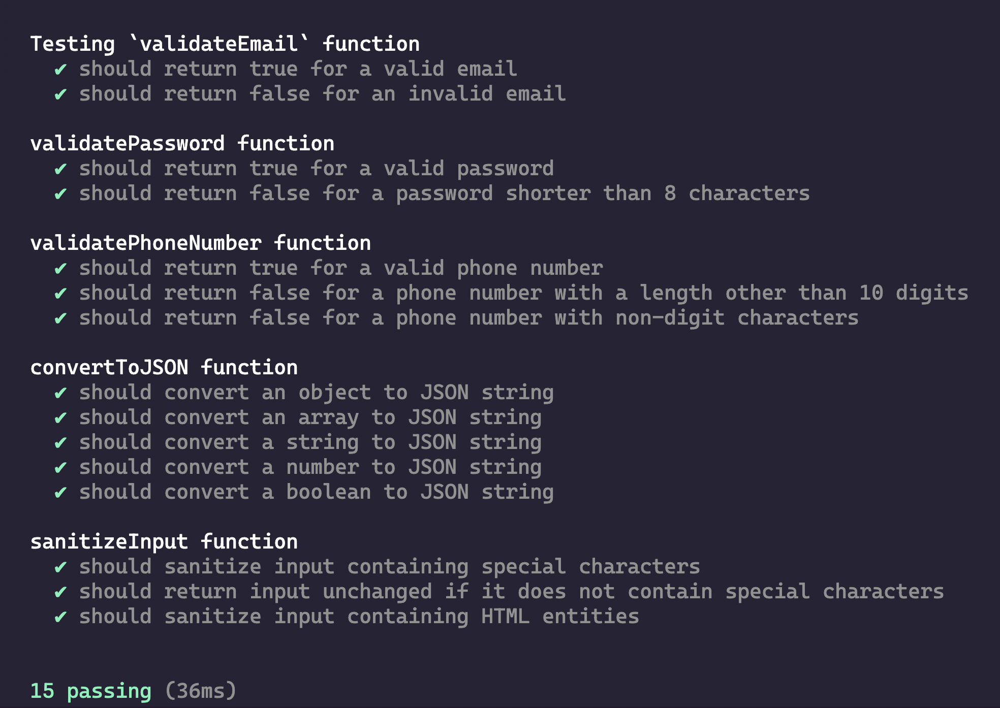

# 

**Learning objective:** By the end of this lesson, students will be able to implement unit tests in Mocha Chai.

## Creating Your First Test

In `src/basic-function.js`, let's look at the first function: 

```js
function validateEmail(email) {
    const re = /\S+@\S+\.\S+/;
    return re.test(email);
}
```

This function takes a single argument, provides a [regular expression](https://developer.mozilla.org/en-US/docs/Web/JavaScript/Guide/Regular_expressions) that checks for the pattern of an email address, and then returns `true` or `false` based on if the provided email matches the pattern or not. 

In Mocha, the `it()` function is used to execute tests. The first argument is a string, which is used to describe the test. Then, it accepts a callback function that will execute assertions. 

```js
it('should return true for a valid email', () => {

});
```

Within the callback function, there are two phases. 

In the first phase, the function being tested is invoked. 

First, any conditions that the test relies upon will be set up. For example, to test the `validateEmail` function, we'll create a new `validEmail` variable and assign it to a string with a valid email format. 

Next, we pass the test string to `validateEmail`, and assign the result to a variable called `result`.

```js
it('should return true for a valid email', () => {
    const validEmail = 'test@example.com';
    const result = validateEmail(validEmail);
});
```

In the second phase, we check the `result` against our expected results. Given how the function should work, We `expect()` the `result` of passing a valid email to our function to be `true`. Since `expect` syntax uses chained language, the code is written literally as: `expect(result).to.be.true`

```js
it('should return true for a valid email', () => {
    const validEmail = 'test@example.com';
    const result = validateEmail(validEmail);
    expect(result).to.be.true;
});
```

This could also be expressed as `expect(result).to.equal(true)`.

## Anatomy of a Unit Test

Let's look at the next function: 
```js
function validatePassword(password) {
    return password.length >= 8;
}
```

```js
it('should return true for a valid password', () => {
    const validPassword = 'password123';
    const result = validatePassword(validPassword);
    expect(result).to.be.true;
});
```

[tktk great opportunity for a Hunter diagram] 

## Implementing Test Cases

Often, we'll want to implement multiple tests for the same function. For instance, when validating a phone number, we're using a regular expression that matches a string of 10 digits: 

```js
function validatePhoneNumber(phoneNumber) {
    const re = /^\d{10}$/;
    return re.test(phoneNumber);
}
```

When unit testing this function, we might want to check both that the phone number is the correct length, and also that the string contains only digits. 

We can use the `describe()` function to group tests. `describe()` accepts a string which will describe the group of tests, and then a callback function which contains multiple `it()` tests. 

```js
describe('validatePhoneNumber function', () => {
    it('should return true for a valid phone number', () => {
        const validPhoneNumber = '1234567890';
        const result = validatePhoneNumber(validPhoneNumber);
        expect(result).to.be.true;
    });

    it('should return false for a phone number with a length other than 10 digits', () => {
        const invalidPhoneNumber = '123456789';
        const result = validatePhoneNumber(invalidPhoneNumber);
        expect(result).to.be.false;
    });

    it('should return false for a phone number with non-digit characters', () => {
        const invalidPhoneNumber = '123abc4567';
        const result = validatePhoneNumber(invalidPhoneNumber);
        expect(result).to.be.false;
    });
});
```

## Running Tests and Interpreting Outputs

Before we run our tests, let's add a few more tests for all of our functions. Update `test/basic-functions.test.js` to the following: 

```js
// test/basic-functions.test.js

const { expect } = require('chai');
const { validateEmail, validatePassword, validatePhoneNumber, convertToJSON, sanitizeInput } = require('../src/basic-functions');

describe('Testing `validateEmail` function', () => {
    it('should return true for a valid email', () => {
        const validEmail = 'test@example.com';
        const result = validateEmail(validEmail);
        expect(result).to.be.true;
    });

    it('should return false for an invalid email', () => {
        const invalidEmail = 'invalidemail';
        const result = validateEmail(invalidEmail);
        expect(result).to.be.false;
    });
});

describe('validatePassword function', () => {
    it('should return true for a valid password', () => {
        const validPassword = 'password123';
        const result = validatePassword(validPassword);
        expect(result).to.be.true;
    });

    it('should return false for a password shorter than 8 characters', () => {
        const invalidPassword = 'pass';
        const result = validatePassword(invalidPassword);
        expect(result).to.be.false;
    });
});

describe('validatePhoneNumber function', () => {
    it('should return true for a valid phone number', () => {
        const validPhoneNumber = '1234567890';
        const result = validatePhoneNumber(validPhoneNumber);
        expect(result).to.be.true;
    });

    it('should return false for a phone number with a length other than 10 digits', () => {
        const invalidPhoneNumber = '123456789';
        const result = validatePhoneNumber(invalidPhoneNumber);
        expect(result).to.be.false;
    });

    it('should return false for a phone number with non-digit characters', () => {
        const invalidPhoneNumber = '123abc4567';
        const result = validatePhoneNumber(invalidPhoneNumber);
        expect(result).to.be.false;
    });
});


describe('convertToJSON function', () => {
    it('should convert an object to JSON string', () => {
        const data = { key: 'value', number: 123 };
        const result = convertToJSON(data);
        const expectedResult = JSON.stringify(data);
        expect(result).to.equal(expectedResult);
    });

    it('should convert an array to JSON string', () => {
        const data = [1, 2, 3, 'four'];
        const result = convertToJSON(data);
        const expectedResult = JSON.stringify(data);
        expect(result).to.equal(expectedResult);
    });

    it('should convert a string to JSON string', () => {
        const data = 'Hello, world!';
        const result = convertToJSON(data);
        const expectedResult = JSON.stringify(data);
        expect(result).to.equal(expectedResult);
    });

    it('should convert a number to JSON string', () => {
        const data = 42;
        const result = convertToJSON(data);
        const expectedResult = JSON.stringify(data);
        expect(result).to.equal(expectedResult);
    });

    it('should convert a boolean to JSON string', () => {
        const data = true;
        const result = convertToJSON(data);
        const expectedResult = JSON.stringify(data);
        expect(result).to.equal(expectedResult);
    });
});

describe('sanitizeInput function', () => {
    it('should sanitize input containing special characters', () => {
        const input = '<script>alert("XSS attack!");</script>';
        const result = sanitizeInput(input);
        const expectedResult = '&lt;script&gt;alert("XSS attack!");&lt;/script&gt;';
        expect(result).to.equal(expectedResult);
    });

    it('should return input unchanged if it does not contain special characters', () => {
        const input = 'Hello, world!';
        const result = sanitizeInput(input);
        expect(result).to.equal(input);
    });

    it('should sanitize input containing HTML entities', () => {
        const input = '&lt;p&gt;This is a paragraph.&lt;/p&gt;';
        const result = sanitizeInput(input);
        const expectedResult = '&amp;lt;p&amp;gt;This is a paragraph.&amp;lt;/p&amp;gt;';
        expect(result).to.equal(expectedResult);
    });
});
```

To run tests, enter `npm test` into the terminal, followed by the directory:

```bash
npm test test/basic-functions.test.js
```

Checking the terminal, we should see the following logged: 



The `describe()` text logs, with the individual tests displayed underneath. Passing tests will have a green checkmark, failing ones will have a red x. 

Look over the provided tests to get a better sense of how the provided functions have been tested! 
