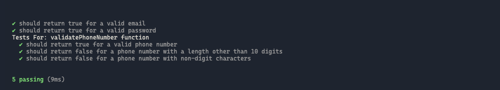
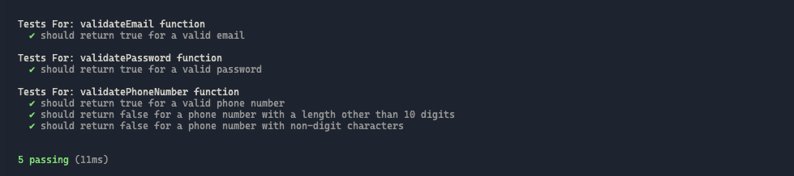

<h1>
  <span class="headline">Unit Testing in JavaScript</span>
  <span class="subhead">Unit Tests with Mocha Chai</span>
</h1>

**Learning objective:** By the end of this lesson, students will be able to implement unit tests in Mocha Chai.

## Exploring the starter code

Let's imagine the starter code we're working with is part of a larger codebase. In the `src` folder, there's a file named `basic-functions.js`, which is a collection of helper functions. These functions are designed to validate user information from a form, such as email addresses and phone numbers. As the name suggests, these helper functions are quite useful, especially in an application where you need to validate email addresses or phone numbers in various places.

These helper functions are ideal candidates for unit testing. With unit tests, we can ensure that, no matter where in the application these functions are used, they consistently produce the correct output for various inputs.

As we develop our unit tests, we'll be using two key tools: Mocha and Chai. Mocha is a testing framework, while Chai is an assertion library that enhances Mocha’s capabilities. Together, they provide us with a more intuitive way to write unit tests. The syntax they offer is closer to plain language or pseudocode, which simplifies both writing and reading tests. Once you're familiar with their syntax, creating and understanding tests becomes much more straightforward.

## Creating your first unit test

Let's look at the first function in `src/basic-functions.js`:

```js
function validateEmail(email) {
  // Check if the email contains the '@' symbol and a '.'
  if (email.includes("@") && email.includes(".")) {
    return true;
  }
  return false;
}
```

This function checks for the presence of `'@'` and `'.'` in an email string. If both are found, it returns `true`, indicating a likely valid email. If either is missing, it returns `false`. This is a basic check and very beginner-friendly, although it's not as robust as using a regular expression.

### Setting up our test in Mocha

In Mocha, we use the `it()` function to define and run tests. Each test is written as a sentence in plain English to describe what the test is checking for. Here's the basic structure:

```js
it("description of what the test should do", () => {
  // Test code goes here
});
```

Let's write a test to check if `validateEmail` correctly identifies a valid email address.

### Create a test file

Create a new file called `basic-functions.test.js` inside the `/test` directory.

```bash
touch basic-functions.test.js
```

At the top of the file, add the following line to import the `expect` function from Chai:

```js
const { expect } = require("chai");
```

Finally, import the helper function you intend to test:

```js
const { validateEmail } = require("../src/basic-functions.js");
```

### Describe the test

First, describe what the test will do:

```js
it("should return true for a valid email", () => {});
```

### Set up test conditions

Inside the function, we first set up the conditions for the test. In this case, we'll create a test string that looks like a valid email.

```js
it("should return true for a valid email", () => {
  const validEmail = "test@example.com";
  // Next, we'll invoke the function and check the result
});
```

Next, we pass the test string to `validateEmail`, and assign the result to a variable called `result`.

```js
it("should return true for a valid email", () => {
  const validEmail = "test@example.com";
  const result = validateEmail(validEmail);
  // Now, we'll verify the result
});
```

### Assert the expected outcome with Chai

Use Chai's `expect` function to check if the result matches what we expect. In this case, since `validEmail` is a valid email, we expect `result` to be `true`.

```js
it("should return true for a valid email", () => {
  const validEmail = "test@example.com";
  const result = validateEmail(validEmail);
  expect(result).to.be.true; // Chai assertion
});
```

Chai's `expect` function checks if `result` is `true`. The `.to.be.true` part reads almost like English, making it clear and intuitive what you're testing for.

Alternatively, you can write the assertion as: `expect(result).to.equal(true)`.

### Run the test

To run our test and see the output run `npm test` followed by the file name in your terminal:

```bash
npm test test/basic-functions.test.js
```

## 🎓 You Do: Write a unit test for `validatePassword`

Let's look at the next helper function in `basic-functions.js`:

```js
function validatePassword(password) {
  return password.length >= 8;
}
```

This function checks if a given password is at least 8 characters long and returns true if it is, or false otherwise.

1. Import the `validatePassword` function in `basic-functions.test.js`
2. Define the test with Mocha's `it()` function.
3. Create a variable containing a sample password.
4. Pass the sample password to the `validatePassword` function and capture the result in a variable.
5. Use Chai's `expect` to check if the result is `true`.

## Implementing multiple test cases

Often, we'll want to implement multiple tests for the same function. Let's import the next helper function for validating a phone number. Here we're using a regular expression that matches a string of 10 digits:

```js
function validatePhoneNumber(phoneNumber) {
  const re = /^\d{10}$/;
  return re.test(phoneNumber);
}
```

When unit testing this function, we might want to check both that the phone number is the correct length, and also that the string contains only digits. For this helper function, we'll create three test cases and group them together.

We can use Mocha's `describe()` function to group related tests. `describe()` accepts a string describing the group of tests, and then a callback function that contains multiple `it()` functions:

```js
describe("Tests For: validatePhoneNumber function", () => {
  // test case 1
  it("should return true for a valid phone number", () => {
    const validPhoneNumber = "1234567890";
    const result = validatePhoneNumber(validPhoneNumber);
    expect(result).to.be.true;
  });
  // test case 2
  it("should return false for a phone number with a length other than 10 digits", () => {
    const invalidPhoneNumber = "123456789";
    const result = validatePhoneNumber(invalidPhoneNumber);
    expect(result).to.be.false;
  });
  // test case 3
  it("should return false for a phone number with non-digit characters", () => {
    const invalidPhoneNumber = "123abc4567";
    const result = validatePhoneNumber(invalidPhoneNumber);
    expect(result).to.be.false;
  });
});
```

## Running tests and interpreting outputs

To run our tests and see the output, enter `npm test` into the terminal, followed by the directory:

```bash
npm test test/basic-functions.test.js
```

Checking the terminal, we should see the following logged:



> Passing tests will have a green checkmark, failing ones will have a red x.

Here we see the individual tests logged for `validateEmail` and `validatePassword`, and a trio of tests grouped using the `describe()` function for `validatePhoneNumber`. To create a cleaner output we can add a `describe()` function for each of these individual tests as well.

Here are some tips for writing your `describe()` statements:

- The string passed to `describe()` should clearly describe the functionality being tested. It's often phrased as a statement about the feature or component under test.
- While it’s important to be clear and descriptive, overly long or complex descriptions can make your tests harder to follow. Aim for concise yet descriptive titles.
- Typically, each `describe()` block focuses on a single function or feature. For example, if you're testing a function named calculateTotal, your `describe()` might be describe("calculateTotal function", () => {...});

Let's add a describe function for our `validateEmail` and `validatePassword` functions also:

```js
describe("Tests For: validateEmail function", () => {
  it("should return true for a valid email", () => {
    const validEmail = "test@example.com";
    const result = validateEmail(validEmail);
    expect(result).to.be.true;
  });
});

describe("Tests For: validatePassword function", () => {
  it("should return true for a valid password", () => {
    const validPassword = "password123";
    const result = validatePassword(validPassword);
    expect(result).to.be.true;
  });
});
```

Now check the output:



Much better!

## Summary

Now that you have some beginner familiarity with writing unit tests using Mocha and Chai, here's a quick recap of what each of these helpful tools offer us:

Mocha:

- Uses `describe()` and `it()` functions for structuring tests.
- `describe()` defines a test suite or group of tests.
- `it()` defines individual test cases.

Chai:

- Offers three assertion styles: `assert`, `expect`, and `should`.
- `assert` uses classic assert syntax (e.g., `assert.equal(value, expected)`).
- `expect` allows natural language assertions (e.g., `expect(value).to.equal(expected)`).
- `should` enables assertions attached directly to object (e.g., `value.should.equal(expected)`).